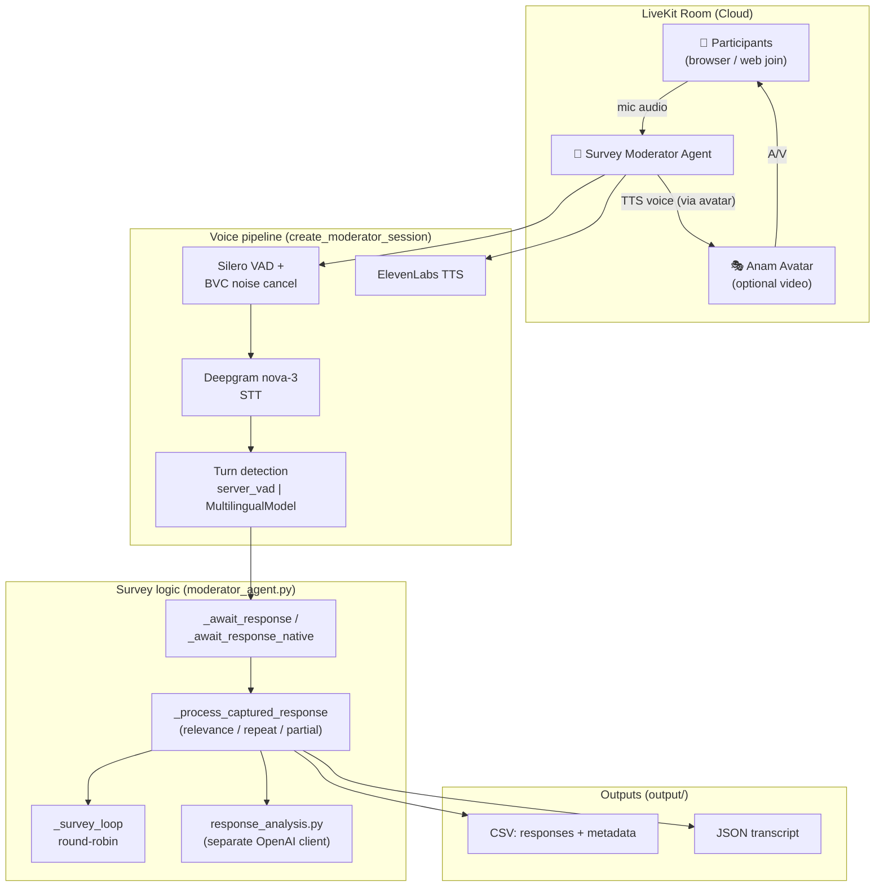

# AI Survey Moderator Agent

An AI-powered **voice survey / focus-group moderator** built on the [LiveKit Agents SDK](https://docs.livekit.io/agents/). The agent joins a LiveKit room, reads survey questions aloud, captures participant responses via real-time speech, manages multi-participant turn-taking, and exports results to CSV/JSON. An optional **Anam talking-head avatar** renders the agent's voice as video.

> For contributor-facing engineering detail (module map, gotchas, deploy runbook), see **[CLAUDE.md](CLAUDE.md)**. For product scope and requirements, see **[docs/PRD.md](docs/PRD.md)**.

---

## Production pipeline

**Deepgram `nova-3` (STT) → OpenAI LLM (temperature 0.0) → ElevenLabs (TTS)**, with **Silero VAD**, LiveKit **`noise_cancellation.BVC()`**, and semantic **end-of-utterance (EOU) turn detection**.

> The code *defaults* to OpenAI STT/TTS (`config/agent_config.py`); the LiveKit Cloud deployment overrides these to Deepgram + ElevenLabs via secrets (`STT_PROVIDER`, `TTS_PROVIDER`, …).

### Turn engine (`TURN_ENGINE`)

| Mode | Turn detection | Behavior |
|------|----------------|----------|
| `legacy` (default) | `server_vad` | Custom `_await_response` polling loop with pause-cooldown/stabilization gates. Known-good; ack latency ~2.5–5s. |
| `native` | `MultilingualModel` (semantic EOU) | LiveKit's EOU model owns end-of-turn; slim waiter; the agent's autonomous LLM replies are suppressed so it only reads scripted questions. **Fast-path acks ~55–400ms.** |

Switch modes with the `TURN_ENGINE` env/secret — no code change. `native` requires three coupled pieces (all in `src/moderator_agent.py`): an `llm_node` block, `on_user_turn_completed` as the response producer, and the slim `_await_response_native` waiter. See CLAUDE.md → *Turn Engine* for why.

---

## Core features

- **Verbatim question reading** — temperature 0.0 + direct-TTS bypass; the agent never invents or paraphrases questions.
- **Multi-participant round-robin** — tracks who was asked vs. who actually answered; observer mode (agent stays silent until an observer says "start survey").
- **Response analysis** — LLM-classified relevance / repeat-request / partial-answer / already-answered, with corrective re-prompts (separate OpenAI client from the voice pipeline).
- **Fuzzy STT correction** — edit-distance + phonetic matching of responses to expected answer options.
- **Turn-time management** — per-turn speaking limit (~45s) with grace periods and wrap-up warnings.
- **Web join experience** — browser UI for participants (FastAPI); the primary, working delivery method.
- **Data export** — per-session CSV (responses + metadata) and full JSON transcript.

> ⚠️ **Zoom integration via Recall.ai is not functional.** The web join experience is the supported path.

---

## Architecture



Two separately-deployed runtimes: the **Agent** runs on **LiveKit Cloud** (`lk agent deploy`); the **web frontend** runs on a **Hetzner VPS** (Docker). See CLAUDE.md → *How to Deploy*.

---

## Run locally (development)

Three terminals:

```bash
# 1 — Agent
PYTHONPATH=src uv run python agent.py dev

# 2 — Web API / frontend
PYTHONPATH=src uv run python web/backend/server.py

# 3 — Public URL for participants
ngrok http 8080
```

Share the ngrok URL for participants to join from their browser. Select a survey with `SURVEY_ID=<id>` (default `poc_focus_group`).

```bash
uv sync                       # install deps (or: pip install -r requirements.txt)
python -m pytest tests/       # run tests
```

## Deploy (production)

```bash
lk agent deploy               # Agent → LiveKit Cloud (agent id from livekit.toml)
lk agent status               # "Sleeping" = scaled to zero (normal)
lk agent logs                 # streams NEW lines only — start BEFORE reproducing
```

Agent secrets live in **LiveKit Cloud**, not the image — editing `.env.local` does not change the deployed agent. Change a single secret via the LiveKit dashboard (`lk agent update-secrets` does a full replace). The web frontend deploys to Hetzner via `git pull` + `docker build`/`docker run` (port 8083→8080).

---

## Configuration

Key env vars (`config/agent_config.py`, overridden by LiveKit Cloud secrets in production):

| Var | Purpose |
|-----|---------|
| `STT_PROVIDER` / `TTS_PROVIDER` | `openai` \| `deepgram` \| `elevenlabs` (prod: deepgram + elevenlabs) |
| `TURN_ENGINE` | `legacy` (default) \| `native` (semantic EOU) |
| `VAD_ACTIVATION_THRESHOLD`, `VAD_MIN_SILENCE_DURATION`, … | Silero VAD tuning |
| `ANAM_AVATAR_ID` | Anam **avatar** id (not a persona id) — the voice routes through the avatar |
| `SURVEY_ID` | Which survey from `surveys_config.yaml` (default `poc_focus_group`) |

---

## Repository layout

| Path | Purpose |
|------|---------|
| `agent.py` | Worker entry point; welcome delivery; wires config → session |
| `src/moderator_agent.py` | Core agent: survey loop, turn engine, response capture, avatar |
| `src/domain/` | Pure logic (turn phase, deadline manager, response analysis, transcription, constants) — mirrored by `tests/` |
| `config/agent_config.py` | Env-driven config + moderator instructions |
| `surveys_config.yaml` | Survey definitions (`survey_id`, `questions_file`) |
| `web/` | FastAPI browser join UI |
| `docs/PRD.md` | Product requirements + architecture |
| `output/` | CSV / JSON exports per session |

---

## License

Proprietary — internal project.
