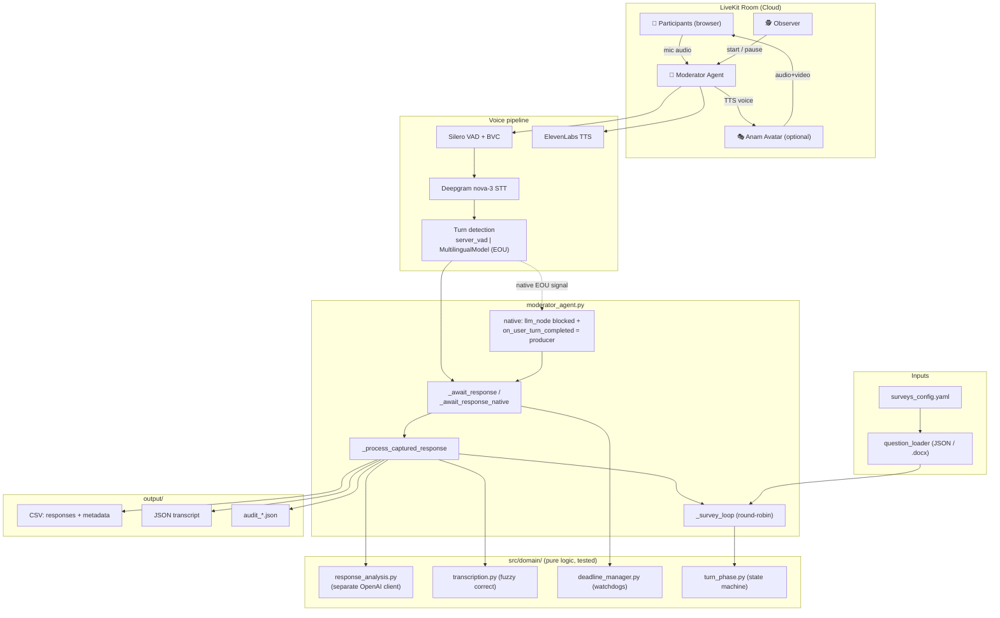
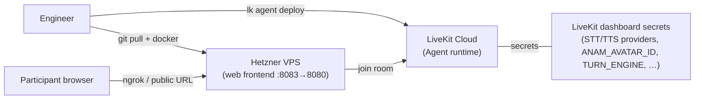

# Product Requirements Document — AI Survey Moderator Agent

**Status:** Living document · **Last updated:** 2026-07-06 · **Owner:** Lever AI

---

## 1. Overview

The AI Survey Moderator Agent is a **voice-driven focus-group / survey moderator**. It joins a real-time room, reads predefined questions aloud, manages turn-taking across one or more participants, captures and lightly validates spoken responses, and exports structured results for analysis. An optional talking-head avatar gives the agent a video presence.

The product's differentiator is **fidelity + control**: unlike a free-form conversational agent, it reads questions **verbatim**, never improvises, and produces **deterministic, exportable data** suitable for research — while still feeling responsive and natural in conversation.

## 2. Problem & motivation

Traditional focus groups and phone surveys are expensive, hard to schedule, and inconsistent between human moderators. Fully-generative voice agents are fast to build but **hallucinate questions, drift off-script, and can't guarantee clean data** — unacceptable for a research instrument. This product occupies the middle: a scripted, auditable moderator with low-latency natural voice interaction.

## 3. Goals & non-goals

### Goals
- Read survey questions **exactly as written** (no invention/paraphrase).
- Capture each participant's response, attributed to the correct person and question.
- Handle real conversation: off-topic answers, repeat requests, uncertainty, partial answers — with corrective re-prompts.
- Feel responsive: **acknowledge a completed answer in ≤ ~1.5s perceived** on the fast path.
- Export clean CSV + JSON per session.
- Support multiple participants via round-robin, plus an observer who starts the session.

### Non-goals
- Not a general conversational assistant; it does not opine or discuss survey topics.
- Not a Zoom bot (Recall.ai integration exists in-tree but is **non-functional**).
- Not a survey-authoring tool; questions are authored externally (JSON/`.docx`).

## 4. Users

| Persona | Needs |
|---------|-------|
| **Participant** | Join from a browser, hear questions, answer by voice, be understood, not be cut off mid-thought. |
| **Observer / researcher** | Start/pause the session, watch it run to completion, get clean exported data. |
| **Operator / engineer** | Deploy, tune latency vs. cutoff risk, roll back instantly, debug from logs. |

## 5. Functional requirements

1. **Question delivery** — read each question (and options) verbatim via direct TTS; announce categories where configured.
2. **Turn-taking** — round-robin across participants; call on each by name; track *expected* vs. *actual* respondent.
3. **Response capture** — transcribe speech; fuzzy-correct to answer options for quantitative questions; accumulate multi-fragment answers.
4. **Response analysis** — classify relevance / repeat-request / partial / already-answered; issue corrective re-prompts (bounded to avoid loops).
5. **Uncertainty & nudges** — encourage on "I don't know"; nudge on silence; skip after timeout so the survey always advances.
6. **Time management** — per-turn speaking cap (~45s) with grace period and wrap-up warning.
7. **Observer mode** — agent stays silent until an observer says "start survey"; supports pause/resume.
8. **Export** — CSV (responses + metadata) and JSON transcript, per isolated session.
9. **Avatar (optional)** — render the agent's voice through an Anam avatar; degrade to audio-only on failure.

## 6. Non-functional requirements

- **Determinism** — LLM temperature 0.0; questions never generated by the model. In `native` turn mode the agent's autonomous LLM is fully suppressed.
- **Latency** — fast-path acknowledgment target ≤ ~1.5s perceived; achieved ~55–400ms of pipeline overhead in `native` mode (remaining perceived time is EOU decision + TTS).
- **Reliability / rollback** — turn engine is feature-flagged (`TURN_ENGINE`); instant revert to the known-good `legacy` path via a secret, no redeploy.
- **Auditability** — per-ack latency metrics and phase-transition logs; audit JSON per session.
- **Privacy** — session-isolated output; no cross-session leakage.

## 7. Architecture

### Deployment topology

## 8. Turn engine (key design decision)

The agent runs **one** turn-taking system at a time, selected by `TURN_ENGINE`:

- **`legacy`** — custom `_await_response` polling loop + endpointing gates. Robust, ~2.5–5s acks.
- **`native`** — LiveKit semantic EOU (`MultilingualModel`) owns end-of-turn (~55–400ms pipeline overhead). Requires suppressing LiveKit's autonomous LLM (`llm_node` empty stream) and using `on_user_turn_completed` as the response producer, because a model turn detector otherwise drives the conversation itself (rogue questions, phantom participants) and `user_speech_committed` fires unreliably. See [CLAUDE.md](../CLAUDE.md) → *Turn Engine* for the full rationale and the debugging history.

Rollout is a **strangler migration**: legacy stays the default until native is proven across demos; legacy is deleted only afterward.

## 9. Data & outputs

- **Responses CSV** — participant, question, corrected response, timestamps.
- **Metadata CSV** — session/survey identifiers, counts, timing.
- **JSON transcript** — full conversation for debugging.
- **Audit JSON** — who said what, when.

## 10. Known limitations & risks

- **Zoom / Recall.ai** integration is non-functional; web join is the only supported path.
- **BVC noise cancellation** is single-speaker-tuned and can attenuate quieter participants (do **not** swap to `NC()` — it crashes the process on a mic sample-rate mismatch).
- **Avatar carries the voice** — a bad `ANAM_AVATAR_ID` (or persona-vs-avatar id mix-up) silences the agent, not just the video.
- **EOU fragmentation** — the semantic detector can occasionally split one answer into two turns; the richest-response picker mitigates this, but it's a watch item.

## 11. Future work

- Delete the `legacy` turn path once `native` is fully proven (codebase simplification).
- Migrate deprecated `min_endpointing_delay`/`turn_detection` params to `turn_handling=TurnHandlingOptions(...)` before livekit-agents v2.0.
- Quantitative-survey support end-to-end (current surveys are all qualitative).
- Optional: fully-supported "manual + external EOU + `commit_user_turn()`" pattern if `native` needs stricter control.
